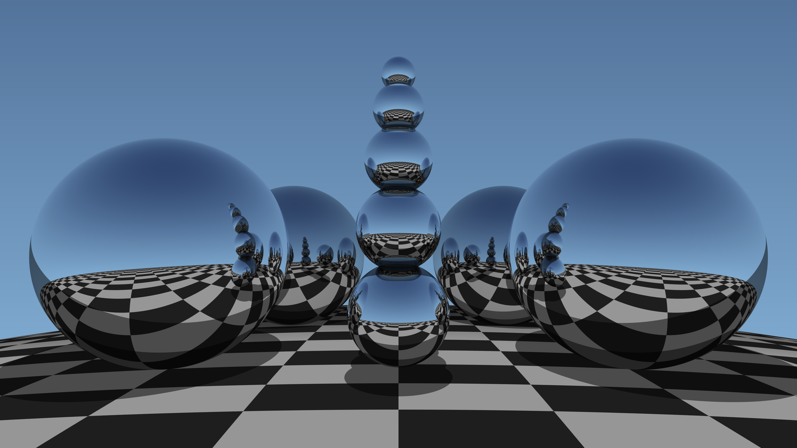
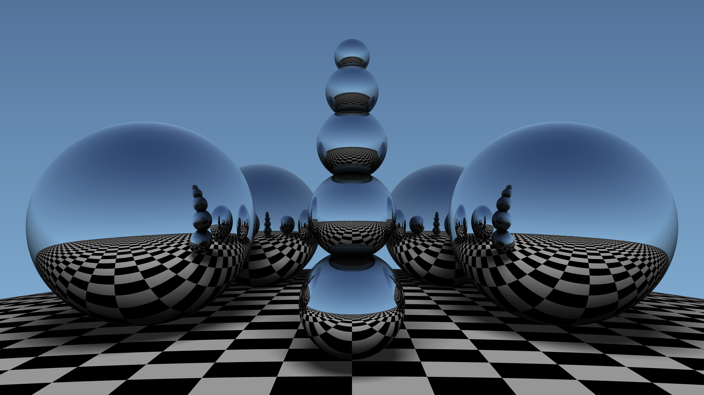

# Ray Tracing

This repository contains various ray tracing algorithms.

 * `Raytracer.Simple` is a simple implementation of a ray tracer.
 * `Raytracer` is supposed to be a physics based ray tracer.

# Examples

Example rendered with 16X supersampling and hard shadows. (4K)

Example rendered with 4X supersampling, Blinn-Phong specular lightning, and 64 shadow rays to approx. a soft shadow. (4K)

# References

 1. [Physically Based Rendering, 2nd ed., Matt Phar, Greg Humphreys.](https://www.amazon.com/Physically-Based-Rendering-Theory-Implementation/dp/0123750792/ref=sr_1_3?ie=UTF8&qid=1548670312&sr=8-3&keywords=physically+based+rendering)
 2. [Reflections and Refractions in Ray Tracing, Bram de Greve, 2006.](https://graphics.stanford.edu/courses/cs148-10-summer/docs/2006--degreve--reflection_refraction.pdf)
 3. [Scratchapixel - Introduction to Shading: Reflection, Refraction, and Fresnel](https://www.scratchapixel.com/lessons/3d-basic-rendering/introduction-to-shading/reflection-refraction-fresnel)
 4. [C++ Example - Refraction](https://github.com/TomCrypto/Lambda/blob/master/src/materials/smoothglass.cpp)